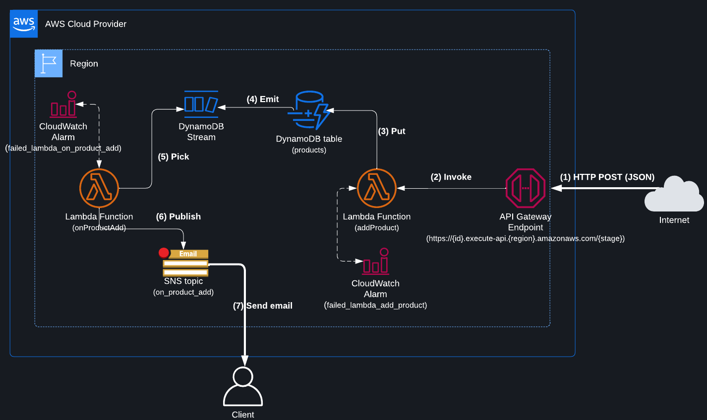

<p align="center">
  
</p>

<p align="center">
    <h1 align="center">Comet Technical Interview</h1>
    <p align="center">This repository contains a proposal for the <a href="https://comets.notion.site/Entretien-Technique-Dev-Backend-914e85eebefb4ca1b218398a36cb58bf">Comet Technical Interview</a>.</p>
</p>

## Prerequisites

In order to start testing this proposal, you'll need Node.js and Terraform:

*   [Node.js](https://nodejs.org/) >= v19.4.0
*   [Terraform](https://www.terraform.io/) >= 1.3.0

<blockquote align="left">
  You will also need to have credentials available to access your AWS account. See the <a href="https://registry.terraform.io/providers/hashicorp/aws/latest/docs#authentication-and-configuration">Terraform AWS provider documentation</a> to learn more.
</blockquote>

## Installation

Once prerequisites are met, you could use NPM to install the required dependencies:

```bash
git clone https://github.com/jeremylevy/comet-technical-interview.git
cd comet-technical-interview
npm install
```

## Usage

The `deploy` command will lint, test, build and create (or update) the infrastructure on your AWS account:

```bash
npm run deploy
```

The `destroy` command will destroy the infrastructure on your AWS account:

```bash
npm run destroy
```

## All commands

* `npm run lint`: execute linting (via ESLint)
* `npm run lint:fix`: execute linting (via ESLint) and fix most errors automatically

* `npm run test`: run tests (via Jest)
* `npm run build`: transpile TS code (via TSC) in the `dist` folder
* `npm run deploy`: lint, test, build and create (or update) the infrastructure on your AWS account
* `npm run destroy`: destroy the infrastructure on your AWS account

#### 💡 Tip: Terraform CLI

The `terraform` command could also be run directly in the `infrastructure` folder.

## Infrastructure



The schema above describe all the components that will be created in your AWS account once deployed:

* The Terraform code used to created these components is located in the [`infrastructure`](https://github.com/jeremylevy/comet-technical-interview/blob/main/infrastructure) folder.

* The source code for the `addProduct` Lambda function is located in [`src/actions/add_product.ts`](https://github.com/jeremylevy/comet-technical-interview/blob/main/src/actions/add_product.ts).

* The source code for the `onProductAdd` Lambda function is located in [`src/events/on_product_add.ts`](https://github.com/jeremylevy/comet-technical-interview/blob/main/src/events/on_product_add.ts).

### Inputs

You will be asked to set the following variables each time you create (or update) the infrastructure:

* `client_email`: the email address that will receive the notifications (e.g. product added or lambda failures)
  
  **During first creation, you will need to confirm the subscription by going to your inbox and clicking on the confirmation links.**

### Outputs

The following outputs will be displayed each time you create (or update) the infrastructure:

* `add_product_endpoint`: the endpoint that will receive your requests to add new products. See below.

## API

The API is available at the URL displayed by the `add_product_endpoint` output. **All routes will receive and respond with JSON.**

### POST /

Create a new product.

#### Parameters

* `name`: the name of the product

#### Examples

```bash
curl -X POST https://9j25tw2n37.execute-api.eu-west-3.amazonaws.com/dev \
  -H 'Content-Type: application/json' \
  -d '{"name":"product_name"}'
```

## License

This proposal is available as open source under the terms of the [MIT License](http://opensource.org/licenses/MIT).
